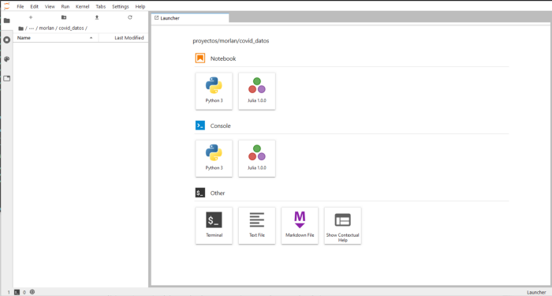
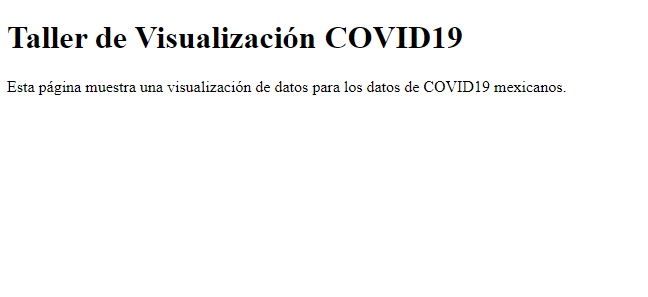

# Taller de visualización de datos, "Visualizando datos de COVID-19"

El objetivo de este taller es mostrar como se va construyendo una visualización de datos interactiva en la web. 

El taller consta de las siguientes partes:

* Descarga de los datos
* Análisis exploratorio de los datos
* Procesamiento de los datos
* Generación de insumos para la visualización de datos
* Generación de la visualización de datos

Usualmente para llevar a cabo una visualización de datos necesitamos procesar los datos y luego visualizarlos. Son dos procesos diferentes, aunque ambos invloucran la realización de gráficas. Es importante separar estos procesos. Cada uno de los procesos se realiza con tecnologías diferentes.

El procesamiento de datos se lleva a cabo utilizando lenguajes de programación con capacidades de análisis de datos. Usualmente se utiliza Python o R. En este taller utilizaremos python.

La realización de visualñizaciones interactivas en la web también se puede hacer desde python o R a traves de algunas librerías con capacidades de visualización de datos interactiva, sin embargo la manera más versatil para visualizar datos es a traves de JavaScript. En este taller visualizaremos utilizando D3js.

## Instalar Python, Anaconda, Juputer Lab, Pandas, Bokeh y todo lo demás...

Para la parte de procesamiento de datos necesitarás instalar [python](https://www.python.org/) y algunas librerías para poder procesar y análizar datos de forma eficiente. 

La forma más fácil de instalar python y las librerías necesarias para analizar datos es a traves de [Anaconda](https://www.anaconda.com/products/individual).

También puedes intalar python por separado siguiendo las instrucciones en su [página](https://www.python.org/downloads/) y luego instalar cada una de las librerías necesarias.

Se puede trabajar con python de muchas maneras. Desde su interprete, desde archivos o scripts. Nosotros trabajaremos con python utilizando Notebooks de [Jupyter](https://jupyter.org/). Estos notebooks nos permiten ejecutar código de forma secuencial y manteniendo los resultados de las ejecuciones anteriores. 

Si instalaste python a traves de Anaconda, el ambiente de trabajo JupyterLab ya se encuentra en tu sistema. Si instalaste python a traves de la página de python o ya lo tenías necesitarás instalar [JupyterLab](https://jupyter.org/install.html).

Para poder analizar y visualizar datos usaremos la librería [Pandas](https://pandas.pydata.org/pandas-docs/stable/index.html) y la librería [Bokeh](https://docs.bokeh.org/en/latest/index.html). Si instalaste todo a traves de Anaconda ya los tienes en tu sistema, si necesitas intalarlos puedes seguir las instrucciones para instalar [Pandas](https://pandas.pydata.org/pandas-docs/stable/getting_started/index.html#getting-started) y [Bokeh](https://docs.bokeh.org/en/latest/docs/installation.html).

## Lanzar el Jupyter Lab

Para ocupar JupyterLab necesitas ejecutar el comando "Jupyter Lab" en tu terminal. Si estas en windows e instalaste anaconda tendras una nueva terminal llamada "Anaconda Terminal". Necesitas lanzar el Jupyter Lab desde ahí.

Jupyter Lab se ejecutará en una pestaña de tu explorador. Veras una pantalla similar a esta: 

.

Para comenzar un nuevo notebook basta con dar click en el boton "python 3" bajo la sección de Notebooks.

También existen otras maneras de usar lo Notebooks de Jupyter en otros ambientes, por ejemplo con el editor de texto [VSCode](https://code.visualstudio.com/). Solamente necesitas descargarlo e instalar el complemento para python. Una vez que lo abras e instales el complemento puedes abrir un nuevo notebook desde la pantalla de bienvenida al complemento o presionando Ctrl+Shift+P, buscando python en el cuadro de texto disponible y seleccionando: "Python, create new blank jupyter notebook". 

De cualquiera de las dos maneras tendrás un Notebook nuevecito para trabajar, con una celda disponible. A medida que vayas escribiendo y ejecutando código en esta celda aparecerá el resultado de la ejecución y una nueva celda para seguir trabajando.

La siguiente parte del tutorial tendrás que teclearla en el notebook que acabas de crear.

## Manejo de datos en python

La primera parte del tutorial es en python. Si seguiste las instrucciones para instalarlo en tu sistema puedes encontrar la parte de python en el archivo "taller_python.ipynb" en este repositorio. Te recomiendo que no solo lo leas, codéalo! No hay manera de aprender a analizar, manipular y visualizar datos si no es haciendolo. El archivo puedes abrirlo en el enlace, leerlo e ir tecleando las partes de código en tu propio jupyter notebook.

En esta parte del tutorial se lleva a cabo la descarga, manipulación, análisis y procesamiento de los datos. No te la saltes!

[Enlace a la parte de python del tutorial](https://nbviewer.jupyter.org/github/irvingfisica/taller01/blob/master/taller_python.ipynb)

## Visualización de datos en la web

Una vez que generamos nuestro archivo de datos podemos continuar con el tutorial. 

La siguiente parte del tutorial mostrará como armar una visualización de datos básica en la web. Para trabajar en la web necesitamos otro tipo de tecnologías diferentes a las usadas hasta ahora. Esencialmente necesitaremos montar una página web y generar contenido gráfico en ella. la creación de páginas web involucra la mezcla de diversas tecnologías, usaremos:

* HTML, para construir la estructura básica de la página web
* CSS, para estilizar la página web
* SVG, para pintar elementos gráficos en nuestra página web
* JavaScript, para controlar la parte dinámica y los datos de nuestra página web.

Ninguna de estas tecnologías se ven a fonde en este tutorial. Si te interesa hacer visualización de datos en la web deberías en el futuro aprender mucho más de esos 4 temas. El objetivo del tutorial solamente es mostrar los pasos básicos para empezar en este mundo.

En esta parte del tutorial crearemos un proyecto web. Necesitaras un editor de texto para editar tu código. Te recomiendo alguno de los siguientes: [VScode](https://code.visualstudio.com/), [Sublime](https://www.sublimetext.com/), [Atom](https://atom.io/). También necesitarás tu explorador web, en el usaremos las herramientas de desarrollador por lo cual te recomiendo que utilices [Firefox](https://www.mozilla.org/en-US/firefox/new/) o [Chrome](https://www.google.com/chrome/).

## Creando la estructura de nuestro proyecto

Los proyectos web se componen de muchos archivos. Es importante tener una estructura adecuada para organizarlos. La estructura aquí sugerida no es la única existente, hay muchas más, es simplemente la que a mi me funciona. 

Es necesario que crees una carpeta para guardar tu proyecto, yo la llamé *dataviz*, crea en ella tres subcarpetas llamadas:

```.
dataviz
├── css
├── js         
└── datos                 
```
En la carpeta de datos copiaremos el archivo de datos que procesamos en la parte de python de este tutorial.

Después en nuestro editor crearemos un nuevo archivo en la carpeta principal del proyecto. A este archivo lo llamaremos *index.html*. Este archivo será el archivo principal de nuestra página web. En el haremos un documento html que se traducirá en una pagina web al abrirlo en nuestro explorador.

## El documento html

En este archivo pondremos el siguiente código html:

```.
<!DOCTYPE html>
<html>
<head>
    <meta charset="UTF-8">
    <title>Taller de Visualización COVID19</title>
</head>
<body>
    
</body>
</html>
```

Hay varias cosas importantes en este código: 
* Con la primera línea indicamos que el tipo de documento es un documento html

* Los documentos html se componen de *tags*. En la segunda línea del código podemos ver el *tag* principal **\<html>** abrir y cerrar en la última línea **\</html>**. La mayoría de los tags de html abren y cierran porque pueden contener otros tags dentro. Usualmente la metáfora que se escoge es la de cajas donde un tag es una caja que contiene a otras cajas o la de un arbol donde un tag es una rama de la cual crecen otras ramas.

* Dentro del *tag* **\<html>\</html>** tenemos dos tags que son importantes:
    - El tag **\<head>\</head>** o cabeza del documento en donde pondremos información referente al documento, por ejemplo el *tag* \<meta> que indica meta-información relacionada con el sitio. En este caso se usa para indicar que el encoding a utilizar en el documento es "UTF-8".

    - El tag **\<body>\</body>** o cuerpo del documento en el cual colocaremos todos los tags que tengan contenido para ser presentado en nuestra página.

* Dentro del *tag* **\<head>\</head>** tenemos otro tag, el tag **\<title>\</title>** el cual tiene en su interior el texto "Taller de Visualización COVID19". Muchos tags llevan texto dentro, en este caso el tag nos sirve para ponerle título a nuestro documento. El título no se muestra en el cuerpo del documento, usualmente los exploradores lo muestran en la pestaña del documento. 

Agreguemos contenido a nuestra página web. Dentro del *tag* **\<body>\</body>** colocaremos un encabezado y un párrafo. 

Los tags usados para encabezados son \<h1>, \<h2>, \<h3>, \<h4>, \<h5> y \<h6>. El número indíca la jerarquía del encabezado. Por ahora usaremos un encabezado de jerarquía 1, por lo cual usaremos el tag \<h1>. En nuestro encabezado pondremos el texto "Taller de visualización de datos".

El tag usado para colocar un párrafo es \<p>. Dentro de el pondremos el texto correspondiente a nuestro párrafo.

Nuestro código debería de verse así:

```.
 <!DOCTYPE html>
<html>
<head>
    <meta charset="UTF-8">
    <title>Taller de Visualización COVID19</title>
</head>
<body>
    <h1>Taller de Visualización COVID19</h1>

    <p>Esta página muestra una visualización de datos para los datos de COVID19 mexicanos.</p>
    
</body>
</html>
```

Guardemos el archivo.

## Lanzando un servidor

Para ver nuestra página web necesitamos abrirla en un explorador. En su estado actual podemos abrirlo en cualquier explorador y se mostrará el contenido. Tendrías que ver algo así:



Debido a que manejaremos datos dentro de nuestra página web necesitaremos montar un servidor para mostrarlo. La manera más fácil es montar un miniservidor de pruebas usando python. En tu terminal entra a la carpeta donde está tu proyecto, a la carpeta "dataviz", y ejecuta la siguiente instrucción de python:

```.
python -m http.server
```

despues en la barra de direcciones de tu explorador coloca la siguiente dirección:

```.
http://localhost:8000/
```

deberías de ver tu página representada en el explorador.


